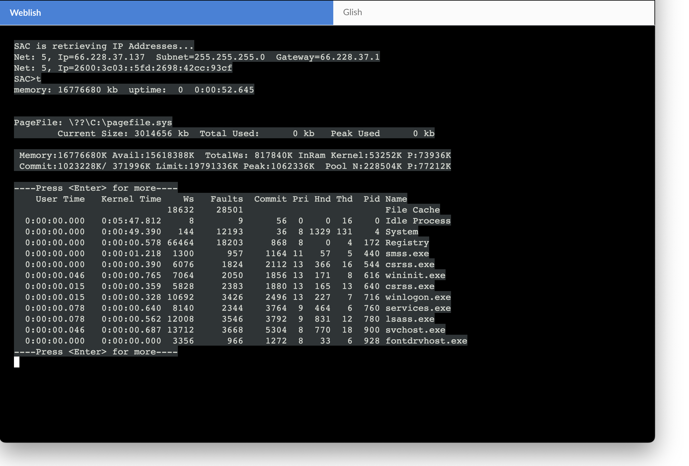

# winode
Automated BYO License Windows Install on Linode

*Warning: This is an unofficial capability that is not officially supported by Linode or Akamai Technologies.  Use at your own risk*

**Please do NOT contact Linode support with questions about Windows as it is out of their scope of support at this time.  Feel free to open an issue here.**

# Features

1. Fully automated installation from upstream Microsoft ISO images for both Windows Server 2022 and Windows 11.  No need to create an initial install on a local server and upload it to Linode.
2. Automation slipstream of all latest VirtIO drivers resulting in full support for Linode local disks (SCSI), network including VLAN and private IPs, and block storage volumes.
3.  Automatic enablement of Emergency Management Services (EMS) to the Linode LISH allowing for recovery via Cloud Manager and SSH.
4.  Automatic enablement of Remote Desktop (RDP) over TCP/3389.  Use Linode Cloud Firewall rules to restrict access!

# Windows License

By default installations are started without a product key and will default to evaluation mode.  The autounattend.xml templates may be modified to insert your own valid product key, or you may manually provide a product key later after your installation is running.  Please note that it is the users responsibiltiy to ensure you are in compliance with Microsoft license terms.  Microsoft allows for use of the evaluation version for testing only.

# Known Issues

1.  Linode Backups require EXT raw filesystem.  The RAW partitioned disk for a winode is therefore not supported.  Critical data should be backed up via some other mechanism.  Linode Object Storage (OBJ) could be leveraged to store this data.
2.  As of December 2022 Linode doesn't support nested virtualization.  As a result Windows Subsystem for Linux (WSL2) will not function.  You may still run WSL1 by forcing it with "wsl --set-default-version 1".  On Windows 11 the following Powershell command is also required "New-ItemProperty HKCU:\SOFTWARE\Microsoft\Windows\CurrentVersion\Lxss DefaultVersion -Value 1 -Force"
3.  Resizing your local disk to a larger disk is supported, but requires manually expanding the NTFS volume within Windows following resizing the RAW Linode disk.  To shrink your disk you must shrink the NTFS volume, and then use a temporary block storage volume to backup the volume, delete the local disk, add a new local disk, and copy the contents back from Block Storage.
4.  The Linode GLISH VNC recovery console lacks support for sending CTRL-ALT-DEL.  The easiest work around is to just use the provided RDP defaults.

# Getting Started

1.  Download install-windows.sh locally.
2.  Modify install-windows.sh to include a valid Linode API token.  For security reasons it is best to create an API key that is short lived, but this is not technically required.  Insert API token into TOKEN.
3.  Generate a secure new Administrator password and insert into configuration file.
4.  Select Windows version and apply to INSTALL_WINDOWS_VERSION.
5.  If installing Windows 11 you must provide your own valid ISO download URL.  You may get a new URL by going to (https://www.microsoft.com/en-us/software-download/windows11).  Note that URLs are valid for 24 hours and then must be updated again.  Alternatively you may download your own copy and self-host it for future installs.  Please URL in W11_ISO_URL.
6.  Create a new Linode Stackscript with the full contents of this modified install-windows.sh file.  When creating your Stackscript ensure you select "Ubuntu 22.04 LTS" as the distribution.
7.  Create a new Linode using this Stackscript.

# Screenshots

